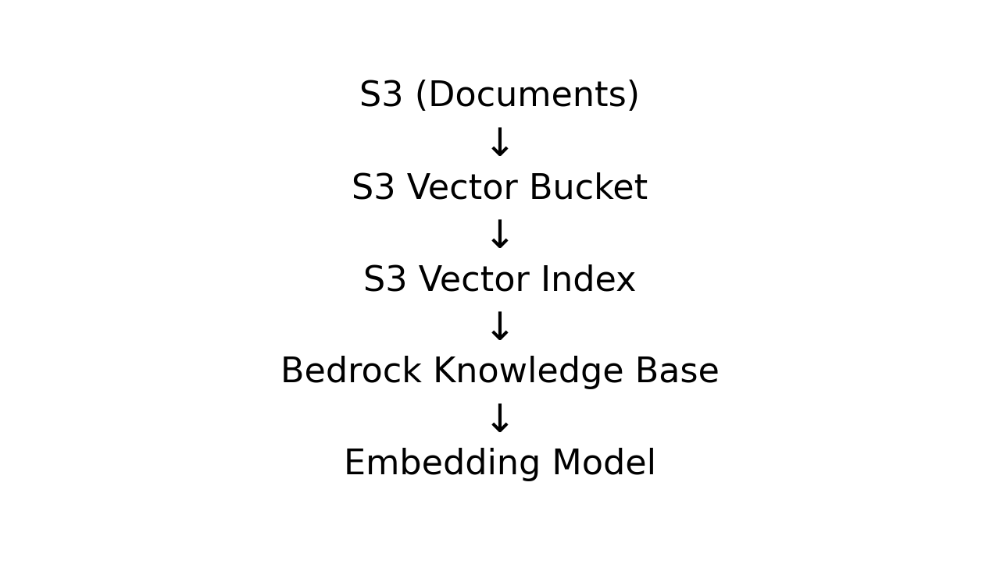

# 🧠 Matrix Vector Nexus


A production-grade Terraform module that deploys **GenAI/RAG infrastructure** end-to-end:

- **S3 Vector Store (Vector Bucket)**
- **S3 Vector Index**
- **Amazon Bedrock Knowledge Base**
- **IAM Roles + least-privilege policies**
- **Embedding model wiring**
- **Bedrock Data Source (S3 documents)**

This module is designed for **reproducible, GitOps-friendly** deployments.

> There isn't a widely-used, single Terraform module pattern that stitches **S3 Vectors + Bedrock KB + IAM + S3 docs** together cleanly.
> Matrix Vector Nexus provides that integration in one reusable module.

---

## 🏗 Architecture



---

## 📦 Repo Structure

```text
matrix-vector-nexus/
├── modules/
│   └── matrix-vector-nexus/     # reusable module
├── examples/
└── basic/                   # runnable example

```

---

## ✅ Requirements

- Terraform **>= 1.5**
- AWS Provider **>= 6.24.0** (for `aws_s3vectors_*` resources)
- AWSCC Provider (for `awscc_bedrock_*` resources)

---

## 🧩 Usage Example

See `examples/basic` for a runnable example.

---

## 🎯 Ideal For

- Production RAG workloads
- Enterprise knowledge retrieval
- Secure internal assistants
- Repeatable GenAI infrastructure

---

## 🗣 Interview-ready talking points

- “I model the GenAI stack as **infrastructure**, not ad-hoc scripts.”
- “I deploy vector stores and Bedrock KBs with **least privilege IAM**.”
- “I design for reproducibility (GitOps), and avoid hidden manual steps.”
